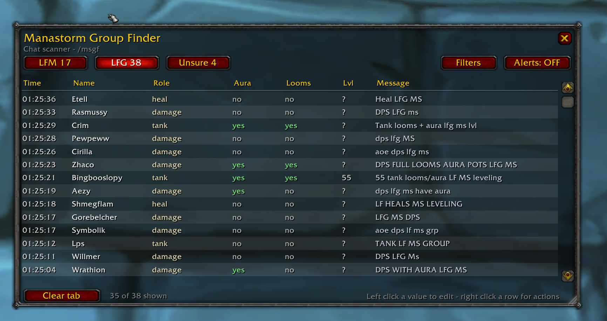
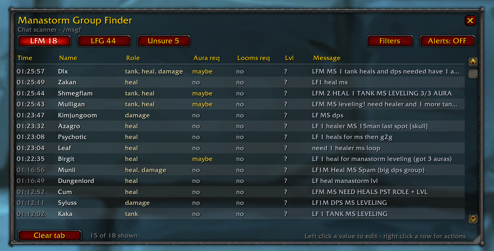
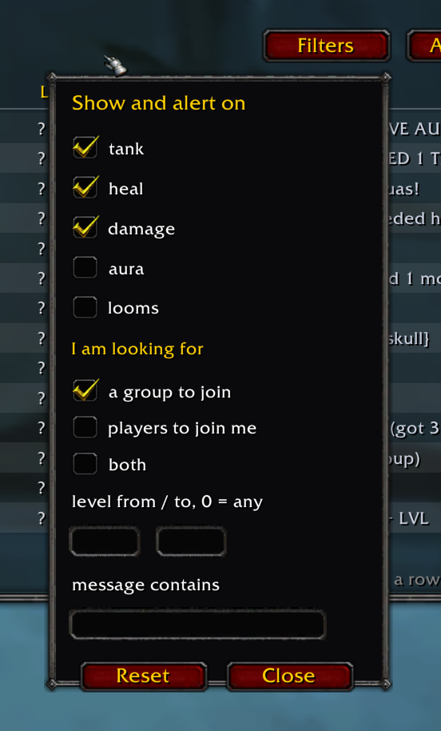

# Manastorm Group Finder

A chat scanner for **World of Warcraft 3.3.5a**, built for **Project Ascension**, that turns the endless stream of Manastorm spam in your chat into a sortable, filterable table.

It reads every chat channel you have enabled, recognises Manastorm group posts, works out whether the sender wants to **join** a group or **fill** one, pulls out role, aura, heirlooms and level where the text mentions them, and lets you whisper, invite or inspect anyone straight from the row.

> ## ⚠ THE FOLDER MUST BE NAMED `ManastormGroupFinder`
>
> **Download [`ManastormGroupFinder.zip` from the Releases page](../../releases) — the file listed under *Assets*, NOT "Source code (zip)".** That one extracts with the correct folder name and needs no renaming.
>
> **Anything else — "Source code (zip)", the green Code button, a tag download — gives you a folder called `ManastormGroupFinder-2.3` or `ManastormGroupFinder-main`. RENAME IT TO `ManastormGroupFinder` before putting it in your AddOns folder, or the game silently ignores it and it never appears in your addon list.**
>
> The client requires the folder name to match `ManastormGroupFinder.toc`, so any suffix breaks it.
>
> ```
> Interface\AddOns\ManastormGroupFinder\ManastormGroupFinder.toc      ✔ loads
> Interface\AddOns\ManastormGroupFinder-2.3\ManastormGroupFinder.toc  ✘ ignored
> Interface\AddOns\ManastormGroupFinder-main\ManastormGroupFinder.toc ✘ ignored
> ```



---

## Contents

- [Why](#why)
- [Features](#features)
- [Installation](#installation)
- [Quick start](#quick-start)
- [The table](#the-table)
- [How a message is classified](#how-a-message-is-classified)
- [Aura and looms](#aura-and-looms)
- [Filters](#filters)
- [Alerts](#alerts)
- [Right-click menu](#right-click-menu)
- [Commands](#commands)
- [Styles](#styles)
- [Troubleshooting](#troubleshooting)
- [What the addon cannot know](#what-the-addon-cannot-know)
- [Is this allowed](#is-this-allowed)
- [Contributing](#contributing)
- [Licence](#licence)

---

## Why

Manastorm groups form entirely through chat. Dozens of `LF MS15 DPS AURA` and `LFM MS leveling need heal` lines scroll past every minute, and by the time you have read one it is three screens up. This addon keeps them all in one window, sorted, deduplicated and one click away from a whisper or an invite.

---

## Features

- **Reads every channel you have enabled** - numbered channels, guild, officer, party, raid, say, yell, whisper, emote, battleground. Two independent capture paths, so it sees exactly what your chat frame sees.
- **Splits posts by intent** - three tabs: **LFM** (someone is filling a group), **LFG** (someone wants in), **Unsure** (genuinely ambiguous wording).
- **Understands Manastorm shorthand** - `manastorm`, `ms`, `ms15`, `ms 15`, `msfarm`, `ms spam`, `ms loop`, and it rejects unrelated `ms` uses such as spell names or item links.
- **Parses role, aura, heirlooms and level** from the text, including compact forms like `LF2M`, `LF3M`, `3/3 aura`, `14/15`, `full looms`, `unloomed`, `no aura`, `big pumper`.
- **Every parsed value is editable** - left click a cell to correct it, your edit is locked and will not be overwritten.
- **Filters** by role, aura, looms, level range, keyword, and which side of the board you are on.
- **On-screen alerts** that show the original message, sized to the text, with a longer hold for the scarce side of the market.
- **Right-click a row** for whisper, invite, target, inspect, trade, follow, duel, who, friend, ignore, copy name, move to another tab, remove.
- **Sortable columns**, resizable window, visible scrollbar plus mouse wheel, minimap button, three visual styles.
- **Automatic housekeeping** - duplicate posts collapse into one row, stale rows dim, old rows expire.

---

## Installation

**The folder must be named exactly `ManastormGroupFinder` — no version number, no `-main` suffix. Rename it if yours has one.**

1. Go to the [Releases](../../releases) page and download **`ManastormGroupFinder.zip`** from the **Assets** list. Do not use *Source code (zip)* — that is GitHub's automatic archive of the repository and it unpacks into a folder named after the tag.
2. Extract it. You should get a single folder named exactly `ManastormGroupFinder` containing `ManastormGroupFinder.toc` and four `.lua` files.
3. Move that folder into your AddOns directory:

   ```
   <WoW folder>\Interface\AddOns\ManastormGroupFinder\
   ```

4. Fully restart the game client. If it was already running, log out to the character screen and press **Reload UI**, or type `/console reloadui`.
5. At the character select screen open **AddOns** and make sure **Manastorm Group Finder** is enabled, with *Load out of date addons* ticked if your launcher is fussy.

The final layout must look like this - no extra nested folder:

```
Interface/AddOns/ManastormGroupFinder/
├── ManastormGroupFinder.toc
├── Parser.lua
├── Core.lua
├── Alerts.lua
└── UI.lua
```

If you downloaded the repository with the green *Code → Download ZIP* button, or *Source code (zip)* from a release, you will get `ManastormGroupFinder-main` or `ManastormGroupFinder-2.3` instead. **Rename it to `ManastormGroupFinder`** or the game will not load it.

---

## Quick start

1. Type **`/msgf`** to open the window, or click the minimap button.
2. Make sure the Manastorm channels are actually joined and visible in your chat frame - the addon can only read what your client receives.
3. Wait a few seconds. Rows appear as people post.
4. Open **Filters** and pick whether you are looking for **a group to join** or **players to join me**. That switches the tab and the alert scope in one go.
5. Turn **Alerts** on and go do something else. When a matching post appears, the message pops up on screen.

Settings and rows are saved per character.

---

## The table

| Column | What it holds |
| --- | --- |
| **Time** | When the message arrived, to the second |
| **Name** | Sender's character name |
| **Role** | `tank`, `heal`, `damage`, or any combination, only ever these three words |
| **Aura** / **Aura req** | Aura of Experience, see below |
| **Looms** / **Looms req** | Heirlooms, see below |
| **Lvl** | Level if the message states one, otherwise `?` |
| **W** | One click whisper. Sends your saved line to that player, then reads `sent` |
| **Message** | The original line, verbatim, expanding as you widen the window |

Click a header to sort, click again to reverse. Left click **Role**, **Aura**, **Looms** or **Lvl** to edit; role and yes/no cells cycle, level opens a small box where **Enter** saves and **Escape** cancels. Edited values turn white and are never overwritten by the parser.

Drag the bottom-right corner to resize. The **Message** column takes all the space the other columns do not need.

---

## How a message is classified

A line must reference Manastorm at all, then the addon decides which side the sender is on with two rules.

**1. What the looking-for token points at.** `LF MS` means *looking for Manastorm*, so the sender wants a group — any role named afterwards is their own role. `LF DPS` points at a person, so the sender is filling a group.

**2. Where the roles sit**, when the object is not decisive. A role before the token describes the sender, a role after it is being recruited.

Recruit signals override rule 1: an explicit headcount (`LF 2 DPS for MS`), a leader phrase (`pst`, `pm info`, `invite bot`, `w me`) or a progress fraction (`13/15`, `2/2 tanks`) keeps the post in LFM.

| Message | Tab | Why |
| --- | --- | --- |
| `LFM MS15 need tank` | LFM | `LFM` is a recruit marker |
| `LF2M MS tanks` | LFM | `LF<number>M` counts players wanted |
| `MS 14/15 PM with level` | LFM | Progress fraction means a group being filled |
| `LF MS DPS` | LFG | `lf` points at Manastorm, so `dps` is the sender's own role |
| `LF MS dps 33` | LFG | Same, with the sender's level |
| `LF MS FARM - LVL 47 DPS full heirloom` | LFG | Same, plus a self advert |
| `LF 60 Dps for MS Duo push` | LFM | `lf` points at a role, so a player is wanted |
| `dps lf ms` | LFG | Role stated *before* the intent word - advertising yourself |
| `LF MS15 DPS AURA ... PM INFO` | LFM | Manastorm object, but `pm info` is leader wording |
| `Tank LF MS farm, send invite` | LFG | Asking to be invited |
| `MS need tank + 1 aura` | LFM | `need` plus a role after it |
| `MS` | Unsure | Not enough to judge |

When the wording is truly ambiguous the row lands in **Unsure**. Right click it and pick **Move to LFM** / **Move to LFG** to file it yourself - your edits ride along.



---

## Aura and looms

A mention of aura or heirlooms means different things depending on who wrote the line, so the value depends on the tab. Nothing is ever shown as unknown, and the reading is deterministic.

**LFG and Unsure tabs** - headers **Aura** and **Looms**. The sender is advertising what they bring:

| Text | Shown |
| --- | --- |
| aura or looms mentioned | **yes** |
| never mentioned | **no** |
| explicitly denied (`no aura`, `unloomed`) | **no** |

**LFM tab** - headers **Aura req** and **Looms req**. A leader naming aura or looms may mean a hard requirement, a nice to have, or what the group already carries, and the text does not say which:

| Text | Shown |
| --- | --- |
| aura or looms mentioned | **maybe**, in yellow |
| never mentioned | **no** |
| explicitly denied | **no** |

Negation is read word by word and carries across a list, so `dps lf ms no aura looms` gives aura **no**, looms **no**, while `unloomed dps with aura` gives aura **yes**, looms **no**. Glued forms are handled: `noaura`, `nolooms`, `unloomed`, plus the usual misspellings of heirlooms.

Moving a row between tabs recomputes both cells for the new tab's meaning, unless you edited them yourself. Clicking a cell cycles **no → maybe → yes**.

**Level** stays `?` unless the message states one, because Manastorm callers rarely bother.

---

## One click whisper

Each row carries a narrow **W** cell between **Lvl** and **Message**. Left click it and the addon whispers that player immediately with your saved line. The cell turns green and reads `sent`, so you can see who you already contacted.

Write the lines with the **Whisper...** button at the bottom of the window, or `/msgf whisper`. There is one line per tab, because the two situations need different wording:

- **LFM tab** - sent to a player leading a group looking for players
- **LFG tab** - sent to a player who is looking for a group

Placeholders are filled in at the moment you click:

| Token | Value |
| --- | --- |
| `{name}` | The listed player |
| `{role}` | Their role as shown in the table |
| `{level}` | Their level, `?` when unknown |
| `{aura}` / `{looms}` | `yes`, `no` or `maybe` as shown |
| `{size}` | Group size when the message states one |
| `{myname}` / `{mylevel}` | Your character name and level |

Example for the LFM tab:

```
Hi {name}, lvl {mylevel} dps with looms and aura, room in your MS?
```

Nothing is ever sent by itself. One click sends one whisper, and hovering a row shows the exact text first.

---

## Filters

The **Filters** button opens an opaque panel anchored under the button. Click anywhere outside it, or press **Close**, to dismiss it.



- **tank / heal / damage** - untick a role to hide it.
- **aura**, **looms** - only show posts that mention them. A `maybe` counts as a mention.
- **I am looking for**
  - *a group to join* - shows recruit posts, alerts only on LFM
  - *players to join me* - shows offers, alerts only on LFG
  - *both* - leaves the tab alone, alerts on either
- **level from / to** - `0` means no bound. Rows with an unknown level always pass.
- **message contains** - plain substring match against the original text.

The panel drives both the table and the alerts, so what you see is what you get pinged about. The footer shows `X of Y shown`. **Reset** clears everything.

---

## Moving the alert popup

Right click the minimap button to unlock the popup. A sample alert appears, drag it anywhere on screen, then right click the minimap button again to lock it. The spot is saved per character. `/msgf alert reset` puts it back to the default, two thirds across the screen at mid height. Real alerts are held back while the frame is unlocked, so the sample cannot be replaced under your cursor mid drag.

While unlocked, the frame is washed blue with a blue border and a **Move me** heading, so the draggable state is obvious at a glance. The wash clears when you lock it.

The bell icon next to the **Alerts** button mutes the sound. A bright bell means the sound is on, a grey bell under a red cross means muted. An alert is then a silent popup. The **Alerts** button itself only switches alerts on and off.

## Alerts

Click **Alerts** to switch them on or off, and use the bell next to it to mute the sound. When a new row passes your filters:

- the original message appears at mid height, two thirds across the screen
- the frame is measured against the text, so short lines get a small frame
- it appears in place with a 0.1 second fade - no sliding, no zooming
- it holds **5 seconds for LFM** and **2 seconds for LFG**, then fades out
- up to five alerts queue behind each other

Recruit posts are far scarcer than offers, which is why the LFM hold is two and a half times longer - those are the ones worth acting on immediately.

Test it any time with `/msgf alert test`.

---

## Suggest Invite

Ascension refuses `InviteUnit` when you are in a group without rank, and offers **Suggest Invite** instead, which sends the group leader a popup to accept or deny.

The row menu reads your party or raid state at the moment you right click:

| Your state | Menu entry |
| --- | --- |
| Solo | **Invite** |
| Party leader | **Invite** |
| Raid leader or assistant | **Invite** |
| In a group with no rank | **Suggest Invite** |

Raid assistants keep **Invite**, because the server lets them invite. A plain leader test would have got that wrong.

Tested on Ascension on 28 July 2026. The client exposes a global `SuggestInvite`, it takes a plain player name, and the group leader receives the accept or deny popup. The addon calls it directly, so one click in a row reaches a player anywhere on the server, with no targeting and no chat spam. The addon prints a confirmation line naming the function it used.

If a future client build renames the function, the lookup falls back to `SuggestInviteByName`, `SuggestInviteUnit`, `SuggestGroupInvite`, `SuggestPartyInvite`, then any global whose name contains suggest and invite, then a slash command registered by the client. `RequestInvite` is never called, even though it exists, because requesting an invite for yourself is a different action.

Two diagnostics ship with the addon: `/msgf probe` lists every suggest related function, slash command, menu button and dialog the client exposes, plus the route used last, and `/msgf group` prints the raw party and raid state.

## Right-click menu

Right click **anywhere** in a row:

**Whisper · Invite · Target · Inspect · Trade · Follow · Duel · Who · Add friend · Ignore · Copy name · Move to LFM / LFG / Unsure · Remove row**

Whisper, invite, who, friend and ignore work from the name alone. Inspect, trade, follow and duel need a real unit reference, so the addon targets the player first and tells you plainly when they are out of range, in another zone, or offline. **Copy name** opens a small box with the name preselected for Ctrl+C.

---

## Commands

`/msgf` or `/manastorm`

| Command | Effect |
| --- | --- |
| `/msgf` | Toggle the window |
| `/msgf lfm` \| `lfg` \| `unsure` | Jump to a tab |
| `/msgf style vanilla` \| `dark` \| `grid` | Change the look |
| `/msgf clear` | Clear the current tab |
| `/msgf clearall` | Clear every tab |
| `/msgf minimap` | Show or hide the minimap button |
| `/msgf alert on` \| `off` | Toggle alerts |
| `/msgf alert sound` \| `chat` \| `popup` | Toggle each output |
| `/msgf alert mode lfm` \| `lfg` \| `any` | Alert scope |
| `/msgf alert test` | Fire a sample alert |
| `/msgf expiry <seconds>` | How long a row survives, default 900 |
| `/msgf own` | Include your own messages |
| `/msgf whisper` | Open the whisper template setup |
| `/msgf whisper lfm <text>` \| `lfg <text>` | Set a tab's whisper line |
| `/msgf debug` | Print every captured line and why it was kept or dropped |
| `/msgf stats` | Events seen, gated, stored, errors |
| `/msgf test <message>` | Run a line through the parser without waiting for it in chat |
| `/msgf help` | List all of the above in game |

---

## Styles

`/msgf style vanilla` uses stock WoW dialog textures and alternating row stripes. `dark` is a flat charcoal panel. `grid` draws visible row and column separators for a spreadsheet feel.

---

## Troubleshooting

**Nothing appears at all.**
Run `/msgf stats`. If `events` is 0 the addon is not receiving chat - check that you have actually joined the channels and that they are shown in your chat frame. If `events` climbs but `stored` stays 0, run `/msgf debug` and post a few of the printed lines in an issue.

**A post was filed in the wrong tab.**
Right click it and move it, then open an issue with the exact text. The classifier is a word-position rule set and grows from real examples.

**A post was ignored completely.**
Try `/msgf test <the exact message>`. If it prints nothing, the Manastorm gate rejected it - open an issue with the line.

**Values look wrong after updating.**
Rows saved by an older version keep their old reading. Run `/msgf clearall` once after every update.

**Nothing loads after installing.**
Almost always a nested folder: `AddOns\ManastormGroupFinder\ManastormGroupFinder\...`. Move the inner folder up one level.

---

## What the addon cannot know

Worth stating plainly, because no addon on 3.3.5a can do better:

- **Chat carries no character data.** A chat event gives the message, the sender's name and the channel. It does not give level, class, spec or gear.
- **Buffs need a unit reference.** Aura of Experience can only be read for yourself, your party, your target and similar - never for a stranger who just posted in a channel.
- **Heirlooms need an inspect.** That requires the player to be targetable and within roughly 10 yards.

So every column other than time, name and message comes from the text people type, which is exactly why every one of them is editable by hand.

---

## Is this allowed

Yes. The addon only reads chat that your client already receives and only acts when you click. It sends nothing on its own, posts nothing, invites nobody automatically and does not whisper in the background. There is no automation of gameplay and no communication with anything outside the game.

---

## Contributing

The most useful contribution is **real chat lines that were classified wrongly or missed**. Open an issue with the verbatim text and the tab you expected.

Code layout:

| File | Responsibility |
| --- | --- |
| `Parser.lua` | Normalisation, token tables, classification. No game API calls, so it is pure text logic and easy to reason about. |
| `Core.lua` | Chat capture, storage buckets, dedupe, expiry, filtering, sorting. |
| `Alerts.lua` | The on-screen popup and its queue. |
| `UI.lua` | Window, table, headers, filter panel, menus, minimap button, styles. |

Keyword tables live at the top of `Parser.lua`. Adding a new role word or a new Manastorm alias is usually a one-line change.

Target is Lua 5.1 with the 3.3.5a API: no `C_Timer`, no `BackdropTemplate`, no retail-only widgets.

---

## Licence

MIT. See [LICENSE](LICENSE).
